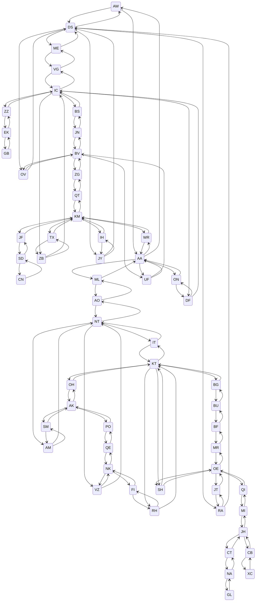

```mermaid
stateDiagram-v2
    AW-->DS
    AW-->AA
    NT-->AO
    NT-->IT
    NT-->AM
    NT-->VZ
    FI-->NK
    FI-->RH
    NK-->VZ
    NK-->QE
    NK-->FI
    ZB-->IC
    ZB-->TX
    DS-->ME
    DS-->JY
    DS-->OV
    DS-->RA
    DS-->AW
    JT-->RA
    JT-->OE
    OH-->KT
    OH-->AK
    OE-->SH
    OE-->MR
    OE-->JT
    OE-->QI
    CT-->JH
    CT-->NA
    CB-->XC
    CB-->JH
    EK-->GB
    EK-->ZZ
    NA-->GL
    NA-->CT
    JY-->DS
    JY-->IH
    RA-->JT
    RA-->DS
    QT-->ZG
    QT-->KM
    SM-->AK
    SM-->AM
    XC-->CB
    BF-->BU
    BF-->MR
    OV-->BV
    OV-->DS
    GB-->EK
    SD-->JF
    SD-->CN
    IH-->JY
    IH-->KM
    DF-->ON
    DF-->IC
    BV-->OV
    BV-->JN
    BV-->ZG
    BV-->UF
    PO-->AK
    PO-->QE
    JH-->CB
    JH-->MI
    JH-->CT
    CN-->SD
    JF-->KM
    JF-->SD
    QI-->MI
    QI-->OE
    JN-->BV
    JN-->BS
    TX-->KM
    TX-->ZB
    ME-->VG
    ME-->DS
    ON-->DF
    ON-->AA
    GL-->NA
    AA-->ON
    AA-->UF
    AA-->WR
    AA-->ML
    AA-->AW
    BS-->JN
    BS-->IC
    RH-->FI
    RH-->KT
    BU-->BF
    BU-->BG
    IT-->NT
    IT-->KT
    MR-->OE
    MR-->BF
    AO-->ML
    AO-->NT
    KM-->WR
    KM-->IH
    KM-->QT
    KM-->TX
    KM-->JF
    ML-->AO
    ML-->AA
    VG-->ME
    VG-->IC
    MI-->QI
    MI-->JH
    AM-->NT
    AM-->SM
    KT-->BG
    KT-->OH
    KT-->RH
    KT-->SH
    KT-->IT
    AK-->SM
    AK-->PO
    AK-->OH
    BG-->KT
    BG-->BU
    QE-->NK
    QE-->PO
    IC-->VG
    IC-->ZZ
    IC-->BS
    IC-->ZB
    IC-->DF
    UF-->BV
    UF-->AA
    SH-->KT
    SH-->OE
    WR-->AA
    WR-->KM
    ZZ-->IC
    ZZ-->EK
    ZG-->BV
    ZG-->QT
    VZ-->NK
    VZ-->NT
```